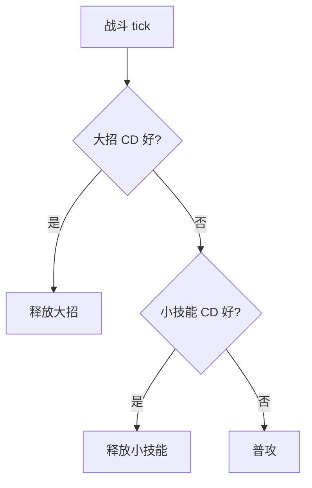

# 封神图表 / Fengshen Diagrams

把项目相关的 Mermaid 图表放在这个文件夹里。

每个图表是一个独立的 `.mmd` 文件。运行项目根目录的 `build.ps1` 后，所有图表会被打包进 `mermaid-studio.html`，出现在工具顶部的「**载入封神图表**」下拉菜单里。

## 加一张图表的完整流程

```text
1. 在本文件夹里新建一个 .mmd 文件          fengshen-diagrams\技能优先级.mmd
2. (可选) 首行写自定义显示名               %% title: 技能优先级 · 主流程
3. 接下来写 Mermaid 代码                   graph TD ...
4. 回到项目根目录，运行 build.ps1          .\build.ps1
5. 双击 mermaid-studio.html 查看效果       新图表已出现在下拉里
6. 提交到 SVN，队友 update 后立即可用     svn commit -m "..."
```

## 文件示例



## 命名约定

- 文件名直接作为下拉显示名（去掉 `.mmd` 后缀）
- 如果首行是 `%% title: 自定义名`，那一行优先级更高
- 文件名可以用中文，但避免 `\ / : * ? " < > |` 这些路径符号
- 一个 `.mmd` 文件 = 一张图表，不要在一个文件里堆多张
- 下拉里按文件名字典序排列
